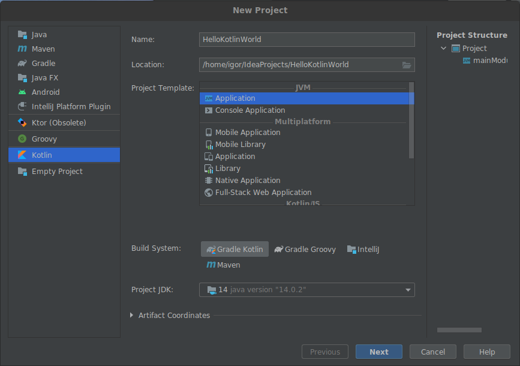
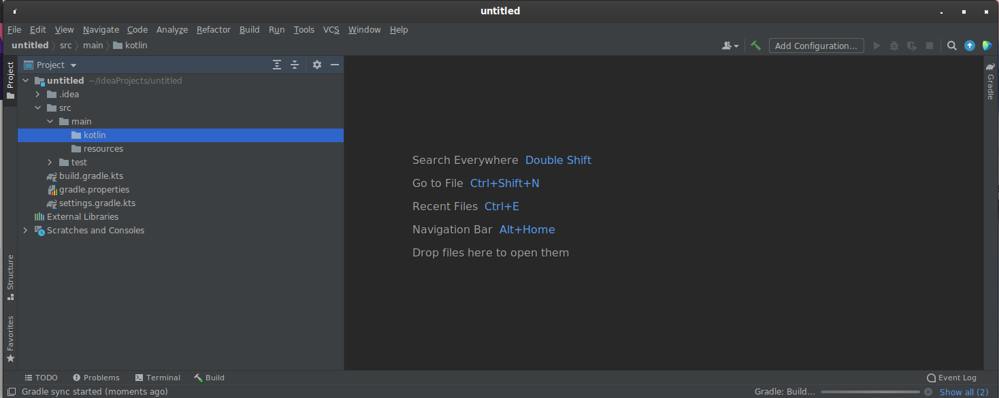
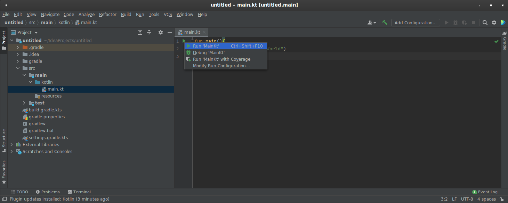
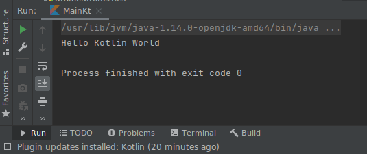

# kotlin-helloworld
Пишем свой HelloWorld на Kotlin

Чем интересен Kotlin? Это современный язык программирования который компилируется в обычный Java байт код. Основную популярность обрёл после объявления основным языком разработки для OS Android. Это был вынужденный шаг, так как корпорация Google столкнулась с противодействием Oracle, владелицей патентов на технологии Java, при внедрении современных версий Java. Развитие Java (на платформе Android) остановилось на версии 7. Конечно была внедрена частичная поддержка Java 8, но этого было очень мало, без каких либо дальнейших перспектив. Чтобы преодолеть платформозависимый Java кризис, на помощь пришёл JetBrains, который предложил свою технологию Kotlin. Kotlin является современным, динамично развивающимся языком программирования, который имеет все современные плюшки и фичи, но при этом байт код компилируется для обычной Java машины без необходимости использовать патенты регулирующие современные Java технологии.

## Устанавливаем среду разработки IntelliJ IDEA
Основным инструментом для написания Kotlin программ является IDE (интегрированная среда разработки) IntelliJ IDEA. Данное приложение разрабатывается компанией Jetbrains из Санкт-Петербурга. Также она является базовым IDE для среды разработки Android Studio(да да, именно так, ребята из питера делаю всемирноизвестный инструмент).

Итак, начнём:
1) Идём сюда и качаем свежую версию IDEA CommunityEdition -https://www.jetbrains.com/idea/download/, для своей операционной системы, конечно (Linux, Win, Mac). Нужен именно Community так как её функциональности нам за глаза, а платить ничего не нужно. Это версия для общественного некоммерческого использования. Устанавливаем как обычно.
2) Запускаем установленную версию. В появившемся  окне выбираем  
"NewProject" ->  
В левом меню выбираем "Kotlin" ->  
Указываем имя проекта "HelloKotlinWorld" ->  
Выбираем папку для хранения проекта или оставляем как есть -> 
Выбираем "Project Template" как "Application" -> 
Далее выбираем "Build System" как "Gradle Kotlin". Данная штука будет собирать для нас проект -> 
Выбираем "Project JDK", в моём случае это будет "14 java version '14.0.2'", у вас возможно что-то другое 
 
После этого нажимаем "Next". В появившемся окне оставляем всё как есть и нажимаем Finish. Откроется окно редактора. 

<ol>
3) Переходим в локацию проекта и нажимаем правой кнопкой мыши на папке "Kotlin" и в выпадающем меню выбираем "New -> Kotlin Class/File". В появившемся меню выбираем "File" и указываем имя файла "main.kt". Откроется окно/вкладка редактора кода, в котором мы будем создавать наше приложение. 
4) В редакторе пишем следующий код:
 
<pre>
<i><b>
fun main(){
    println("Hello Kotlin World")
}
</i></b>
</pre>
</ol>
<q>
Разберём что мы написали. 
 - <i>fun</i> - это объявление функции. Просто объявление и больше ничего. Далее идут скобки в которых можно перечислисть входные параметры функции. В нашем случае они пустые, так как у нашей функции нет входных параметров.
 - Символы "<i>{ }</i>" являются операторными скобками. Операторные скобки, это специальные символы (или как в паскале, команды begin и end) которые огораживают логические куски кода, которые выполнают некие алгоритмы.
 - Команда "<i>println("Hello Kotlin World")</i>" выводит на экран строку текста (которую получает в качестве параметра) и переводит коретку курсора на следющую строку. В нашем случае программа пишет текст "Hello Kotlin World".

После того как мы написали код, напротив строки с текстом "fun main()" появится зелёный значёк Play. Нажимаем на него. В появившимся меню выбираем "Run 'MainKt'". 

Если вы всё сделали правильно, проект соберётся и запуститься. В результате вы сможете видеть нашу строку "Hello Kotlin World" в консоли выполнения программы. 

#### Всё, поздравляю, вы написали своё первое приложение на языке программирования Kotlin :)
